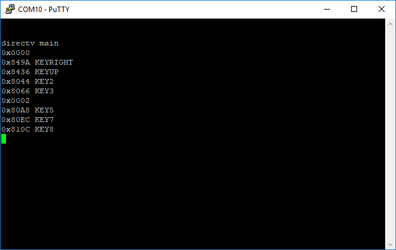

# psoc5DirectvRC65IRReceiver
A PSoC5 hardware-only IR decoder for DirecTV RC65 remote control

/*
 * According to http://www.hifi-remote.com/johnsfine/DecodeIR.html#DirecTV
 * The IRP notation for this protocol is:
 *{38k,600,msb}<1,-1|1,-2|2,-1|2,-2>(5,(5,-2,D:4,F:8,C:4,1,-50)+) {C=7*(F:2:6)+5*(F:2:4)+3*(F:2:2)+(F:2)}
 * Unlike most protocols which use a fixed length mark and a variable length or a variable length
 * mark a fixed length space, this protocol varies both the mark and the space.
 * The stream is still a series of marks and spaces but the length of either of those
 * denotes a one or zero. A length of 1200us=logical 1 and length 600us=logical 0
 * It also makes changes to the length of the header mark to devote repeat codes.
 * The first header mark should be 6000us but repeat codes should only be 3000us.
 */

